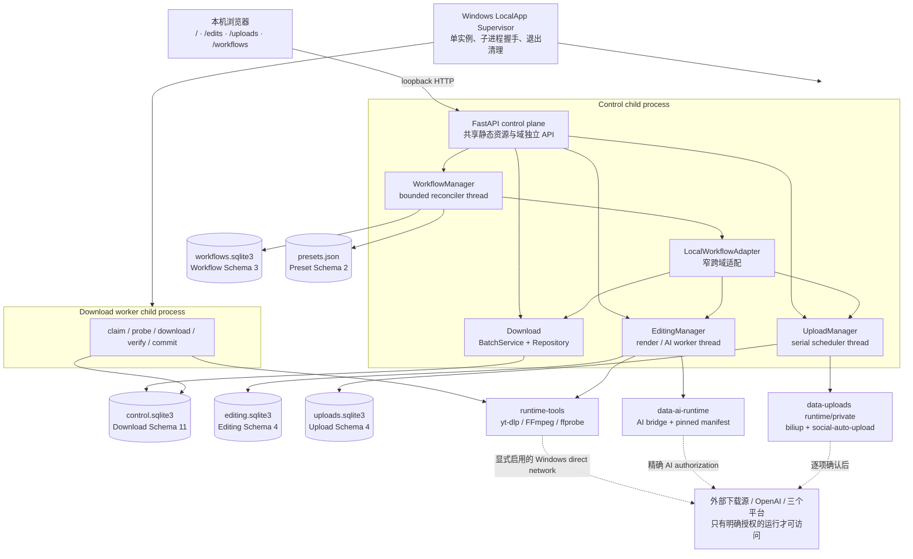
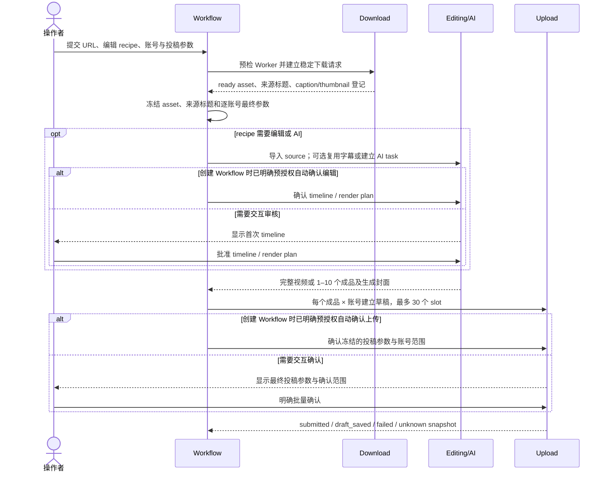
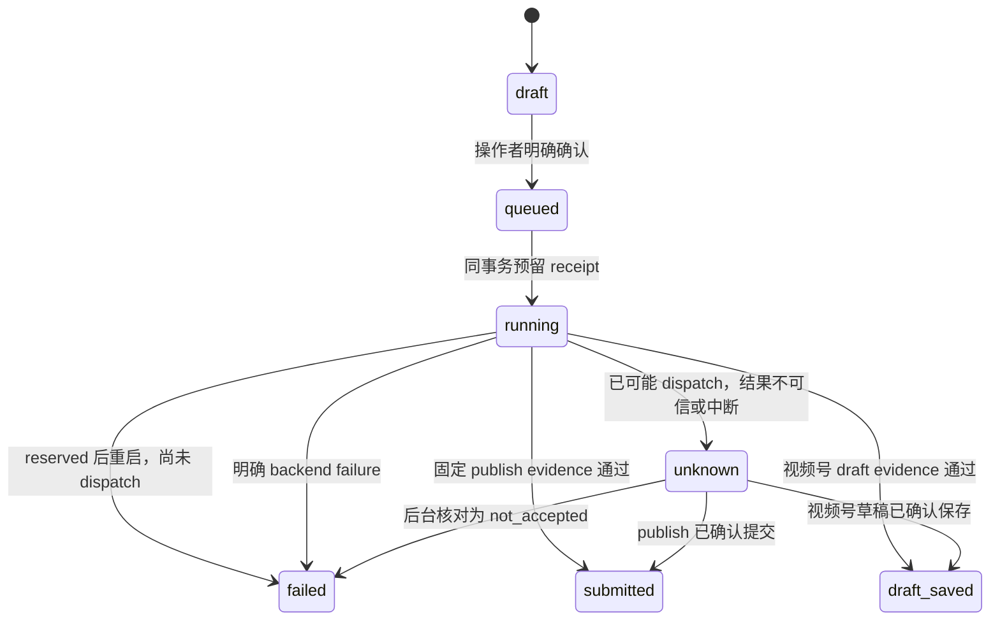

# Open-Flame 当前架构

> 状态日期：2026-09-12（Australia/Adelaide）
> 文档起始源码基线：`30548f32e072ee549a322b840374d09486d63110`
> 产品版本：`0.28.0` 发布后的持续开发源码

本文描述当前代码的部署形态、领域边界、数据所有权和恢复原则。提交、运行或验收前仍须以
`git rev-parse HEAD`、源码常量和对应 validation 记录重新核对；上面的 commit 只标识本文开始
编写时的基线。历史设计、合成验证和本地浏览器 smoke 都不能自动证明当前构建或真实平台能力。

## 1. 架构结论

Open-Flame 是一个面向单机、单管理员、私有环境的**本地模块化单体**。一个 FastAPI control
process 提供下载、编辑、上传和 Workflow 四个页面/API；下载 Worker 是独立进程，编辑、上传与
Workflow 各自拥有控制进程内的生命周期管理器和后台线程。下载工具、AI runtime 与上传 runtime
保持独立的执行和凭据边界。

四个业务域分别保存自己的数据库。Workflow 只保存跨域引用、冻结输入和 checkpoint，通过
[`WorkflowDomainAdapter`](../src/video_download_control/workflows/contracts.py) 调用各域；它不依赖
跨四库事务，也不直接改写其他域的私有表。跨域一致性依靠稳定请求键、版本化摘要、不可变身份、
revision CAS、幂等重放和重新观察收敛。

当前不需要拆成微服务，也不应为了缩短文件引入全局 ORM、消息总线、通用 Scheduler、额外数据库
或额外 runtime。架构精简的衡量标准是删除重复规则、缩小跨域知识和保留失败语义，而不是文件数量。

## 2. 运行拓扑

默认 Windows 本地入口由
[`local_app.py`](../src/video_download_control/local_app.py) 管理 supervisor、control child 与
download worker child。control process 在
[`api.py`](../src/video_download_control/api.py) 中组装四个领域；同一应用实例只绑定 loopback。
Linux/Docker 当前只保留下载 Worker candidate 的部分边界，不能据此推断 Windows 上传 runtime
已经跨平台可用。

仓库包含 egress proxy、Unix relay 和 short-link transport 的 candidate 路径，但当前 Windows
LocalApp 下载在操作者显式启用网络后使用 direct mode。架构图中的网络箭头表示实际可能发生的
边界，不表示所有流量都经过独立代理，也不表示目标平台已验收。

## 3. 页面、API 与生命周期所有者

| 表面 | 主要实现 | 生命周期所有者 | 主要职责 |
| --- | --- | --- | --- |
| `/` 与 `/api/v1/*` | [`api.py`](../src/video_download_control/api.py)、[`web.py`](../src/video_download_control/web.py) | control process + 独立 download worker | URL/批次、队列、来源发现、下载任务、ready assets、能力证据 |
| `/edits` 与 `/api/v1/edits/*` | [`editing/api.py`](../src/video_download_control/editing/api.py)、[`editing/web.py`](../src/video_download_control/editing/web.py) | [`EditingManager`](../src/video_download_control/editing/manager.py) | 非破坏草稿、timeline 审核、AI task、render plan、成品与封面 |
| `/uploads` 与 `/api/v1/uploads/*` | [`uploads/api.py`](../src/video_download_control/uploads/api.py)、[`uploads/web.py`](../src/video_download_control/uploads/web.py) | [`UploadManager`](../src/video_download_control/uploads/manager.py) / [`UploadService`](../src/video_download_control/uploads/service.py) | 账号 session、受管视频/封面、投稿参数、确认、串行上传、attempt receipt |
| `/workflows` 与 `/api/v1/workflows/*` | [`workflows/api.py`](../src/video_download_control/workflows/api.py)、[`workflows/web.py`](../src/video_download_control/workflows/web.py) | [`WorkflowManager`](../src/video_download_control/workflows/manager.py) | 跨域编排、预设、checkpoint、恢复、取消和 attention |

四页使用 [`open-flame.css`](../src/video_download_control/static/open-flame.css) 与
[`open-flame-shell.js`](../src/video_download_control/static/open-flame-shell.js) 的共享 token/壳层，
具体页面仍由各域 `web.py` 生成。视觉基准是
[Editorial Glass](DESIGN_SYSTEM.md)：暖纸/暖炭画布、编辑式标题、深珊瑚层级与墨色主操作；液态玻璃
只放在浮动导航、主命令区和明确浮层。轮询必须保留输入、选区、焦点、二维码和确认状态。

### 3.1 进程与线程

| 所有者 | 形态 | 启停与并发语义 |
| --- | --- | --- |
| LocalApp supervisor | 主进程 | 取得单实例锁，预留 loopback socket，启动/握手/核对两个 child，统一传播停止与清理 |
| FastAPI control | 独立 child process | Uvicorn 在继承的 loopback listener 上先进入 ready；supervisor 随后核对 child 身份并汇总整体 ready，再向操作者报告可用 |
| Download Worker | 独立 child process | preflight/recovery 可先读取 Download DB；持久 claim gate 只原子允许或阻止新的 `claim_next`；两个执行 slot 负责 probe/download/verify/commit，DB 同时限制全局最多 2 个、每平台最多 1 个 active job |
| EditingManager | control 内 lazy worker thread | 单 owner；串行取得任务并协调本地 FFmpeg 与 AI child，持有 Editing activity lease |
| UploadManager / UploadService | control 内 lazy scheduler thread | 应用组装唯一 manager，HTTP/Workflow/退出共用；恢复与关闭串行化，全局串行领取 login/upload operation，有界 cancellation monitor 与 worker lock 保持执行所有权 |
| WorkflowManager | control 内 reconciler thread | 分页扫描 active workflow，有界退避；通过 LocalWorkflowAdapter 逐域观察和推进 |
| AI / Upload bridge | 受各 manager 启动的 child process/runtime | 使用固定 manifest、最小环境与超时；不成为独立常驻业务服务 |

Editing、Upload、Workflow 的线程共享 control process，但不共享数据库连接或跨域事务。进程退出顺序
由 FastAPI lifespan 和 supervisor 共同收敛；`unknown` 远端结果不会通过重启线程自动重放。

### 3.2 命令行入口

[`pyproject.toml`](../pyproject.toml) 暴露的入口按职责分为四组：

| 分组 | 入口 |
| --- | --- |
| 操作者入口 | `video-download-local-app`、`video-download-control` |
| 受管执行 | `video-download-local-worker`、`video-download-worker`、`video-download-candidate-worker` |
| 下载支持与诊断 | `video-download-validation`、`video-download-capabilities`、`video-download-credentials`、`video-download-tools`、`video-download-unix-relay`、`video-download-egress-proxy`、`video-download-short-link-egress` |
| 灾备 | `video-download-backup`、`video-upload-backup` |

这些入口共享源码包，但不等于 14 个独立部署服务；LocalApp 仍是 Windows 桌面运行的默认所有者。

### 3.3 职责分层与当前重构分支

2026-09-12 的 `codex/architecture-reset-ci` 按六类核心职责加 CLI 入口整理依赖。它们是模块化
单体内部的职责，不是六个部署服务；四个业务域继续各自拥有状态。下载 Schema 11 不代表其他
域也使用同一 Schema。

| 职责 | 主要模块与依赖方向 |
| --- | --- |
| API / Web | `api.py`、各域 `api.py/web.py`、`schemas.py`：HTTP/DTO、展示和 composition；不作为可复用 Worker 的实现入口 |
| 领域 / 数据 | `domain.py`、`database.py`、`repository.py`、`worker_repository.py` 和各域 service/schema：实体、事务与领域状态机；`download_assets.py` 拥有 Download 登记素材读取 |
| Worker / 调度 | `worker.py`、`worker_pool.py`、`graph.py`、`retry_policy.py`；新增 `local_worker.py`、`candidate_worker.py` 拥有配置、preflight 和组装 |
| 适配器 | `adapters/base.py` 定义共享 Protocol 与请求/结果；fake 和真实适配器实现它；`yt_dlp_contract.py` 是生产命令/配置合同，并非测试基类 |
| 工具链 / 校验 | `toolchain.py`、`verifiers/ffprobe.py`、capabilities/evidence：版本、产物与能力证据；本地 ready 不自动升级真实平台验收 |
| 安全 / 网络 | `security/`、受管文件与网络执行 guard：身份、出站约束和执行前复验；Windows 显式 direct 模式与 Linux relay 模式保持各自合同 |
| CLI | `*_cli.py`：参数与进程输出，调用执行模块；LocalApp 已直接调用公开 Worker builder/锁/logger，不再从 CLI 私有函数取实现 |

本分支已修复下文第 9 节的前两条失败路径，并收敛两类 adapter 控制记录的 JSONL 解码。
其他职责收敛和完整 CI 恢复仍在继续。Worker 内部接口变化的旧测试迁移草案只在 ignored 目录；
当前测试禁改策略尚未得到用户例外授权，因此不能把局部检查通过写成 CI 完成。详见
[Worker 边界记录](../validation/iteration-0.28.0-worker-entry-boundary.md)。

## 4. 数据所有权与存储布局

默认 `LocalAppConfig` 把 `<app-root>/data` 作为下载 data root，其余域使用同级目录。实际路径可由
受支持的启动参数确定，但同一次 Setup/Start 必须使用同一个经过核对的 canonical app root。

| 所有者 | 默认位置 | 当前格式 | 专用备份 | 只由谁写入 |
| --- | --- | --- | --- | --- |
| Download | `data/control.sqlite3` 与 `data/assets/` 等下载资产 | Schema 11 | `video-download-backup` format 1；排除 `logs/`、`temporary/`、`assets/.staging/` | Download repository/service 与独立 Worker |
| Editing | `data-edits/editing.sqlite3`、`sources/`、`assets/`、`staging/` | Schema 4 | 当前无专用 backup CLI | EditingService / EditingManager |
| AI runtime | `data-ai-runtime/`；任务临时数据在 Editing 根的 `ai-work/` | pinned runtime manifest；AI ledger 位于 Editing Schema 4 | runtime 可重建；不是业务备份源 | AI runtime builder、AI executor 与 Editing ledger |
| Upload | `data-uploads/uploads.sqlite3`、`media/`、`assets/`、`incoming/`、`private/` | Schema 4 | `video-upload-backup` format 3；排除 setup/worker lock、`incoming/`、`private/`、`runtime/` | UploadService、SauBackend 与 runtime setup；账号秘密只留在 private/runtime 边界 |
| Workflow | `data-workflows/workflows.sqlite3` 与 `presets.json` | Workflow Schema 3；Preset Schema 2 | 当前无专用 backup CLI | WorkflowService / WorkflowPresetStore |

这些目录不是一个可以整体原子提交的数据库。Download backup 与 Upload backup 是两条独立命令，
当前也没有覆盖 Editing、Workflow 与 presets 的统一灾备。详细停机、锁和恢复步骤以
[Runbook](RUNBOOK.md) 为准。

### 4.1 领域数据摘要

- **Download** 保存 batch、input、source graph、download job/attempt、media asset、artifact/caption、
  credential profile、capability evidence/decision、queue control 与 platform circuit。
- **Editing** 保存 source、project、draft、render plan、timeline revision、plan binding、AI task、
  AI invocation ledger、request 和输出 asset。
- **Upload** 保存 account/session revision、source、cover asset、job、operation、稳定 request/retry
  lineage 与每个已领取 job 唯一的 `upload_attempts` receipt。
- **Workflow** 保存 workflow 状态、冻结 profile/output/account binding、各域引用、revision、attention
  与 append-only event；预设另存为 secret-free、原子替换的 `presets.json`。

| Schema | 当前核心表或记录 |
| --- | --- |
| Download 11 | 表：`schema_migrations`、`batches`、`input_records`、`source_items`、`source_discoveries`、`source_relations`、`input_relation_jobs`、`download_job_targets`、`download_jobs`、`job_attempts`、`asset_commit_intents`、`media_assets`、`job_assets`、`artifacts`、`captions`、`credential_profiles`、`capability_legacy_schema9`、`capability_evidence`、`capability_decisions`、`queue_control`、`platform_circuits`、`worker_claim_gate`；视图：`platform_capabilities` |
| Editing 4 | `metadata`、`sources`、`projects`、`drafts`、`render_plans`、`timeline_revisions`、`plan_timeline_bindings`、`ai_tasks`、`ai_invocations`、`assets`、`requests` |
| Upload 4 | `metadata`、`accounts`、`sources`、`upload_assets`、`jobs`、`operations`、`requests`、`upload_attempts` |
| Workflow 3 | `metadata`、`workflows`、`workflow_events`；另有 Preset Schema 2 的 `presets.json` |

表名用于说明所有权，不代替 schema module 的精确列、索引、外键和迁移校验。精确结构以
[`database.py`](../src/video_download_control/database.py)、
[`editing/schema.py`](../src/video_download_control/editing/schema.py)、
[`uploads/schema.py`](../src/video_download_control/uploads/schema.py) 和
[`workflows/schema.py`](../src/video_download_control/workflows/schema.py) 为准。

## 5. 跨域合同与一致性模型

[`LocalWorkflowAdapter`](../src/video_download_control/workflows/local_adapter.py) 是当前主要跨域边界。
Workflow 可以请求领域动作并读取公开 snapshot，但领域仍负责自己的状态机、事务、错误码和文件校验。
[`api.py`](../src/video_download_control/api.py) 在组装应用时还通过少量 resolver closure 把 Download
原件/字幕/封面和 Editing 输出交给 Upload、Editing 或 Workflow；这些 closure 是 composition seam，
不拥有跨域业务状态。

| 机制 | 作用 | 不提供什么 |
| --- | --- | --- |
| stable request key / digest | 响应丢失后发现同一请求；绑定冻结输入和重试谱系 | 不把四库合成一个事务 |
| immutable ID / SHA-256 / adapter revision | 阻止来源、封面、账号或执行实现被静默替换 | 不抵御同权限管理员同时改代码和数据 |
| revision CAS | 写入前确认读取的版本仍是当前版本 | 不消除真实远端动作的不确定性 |
| checkpoint + re-observation | 在进程重启或跨域响应丢失后从已持久状态继续 | 不允许自动重放 `unknown` 远端调用 |
| tombstone / cancellation intent | 在对象尚未写回 Workflow 引用时阻止并发重建 | 不声称远端平台已经取消 |
| attempt / invocation ledger | 记录本地 dispatch 边界与固定结果分类 | 不是平台或 provider 签名回执 |

### 5.1 URL 到投稿草稿

`segments: []` 表示完整视频；只制作封面也会产生可上传的完整视频。来源 caption 或 thumbnail 必须
绑定同一个 ready original 并重新校验受管文件身份。来源封面是平台返回并由 yt-dlp 选中的 thumbnail，
不保证是发布者原始母版、最高分辨率或 Douyin 的 `origin_cover`；视频号当前没有专用下载 extractor。

### 5.2 上传 attempt receipt

Upload Schema 4 在领取任务时，把 `queued → running` 与 `reserved` receipt 放在同一事务；调用
backend 前先持久化 `dispatch_may_have_started`，backend 返回后再把 receipt 结果和 job 终态放在
同一事务。receipt 绑定 job/request/root、账号 session、source/cover SHA-256、product build、
adapter identity、固定 evidence、时间戳与 revision。

`unknown` 不能直接 retry。操作者必须先读取 receipt，再到对应平台后台核对；只有固定
`not_accepted` 结论落库后才能建立新的待确认草稿。任何没有 receipt 的旧 failed/canceled job 都
不能根据可变 job 字段推断为“从未 dispatch”。完整合同见
[Upload Schema 4 attempt receipt 记录](../validation/iteration-0.28.0-upload-attempt-receipts.md)。

## 6. 执行环境与外部边界

| 执行边界 | 当前实现 | 当前证据限制 |
| --- | --- | --- |
| Download tools | 固定的 yt-dlp、FFmpeg、ffprobe 与 manifest；独立 Worker 执行 | 本地 runtime ready 不等于任意网站真实下载成功 |
| AI runtime | 隔离 bridge；精确 runtime/model/operation authorization 与硬预算；密钥仅允许进入 control child 环境 | 当前实际应用根没有 API key，真实响应、费用、质量与试听未验收 |
| Upload runtime | Windows 上固定 biliup 与 social-auto-upload revision；Bilibili、Douyin、Tencent 三个平台 | session ready、本地 evidence 或 receipt 都不是平台接受、审核或公开可见证明 |

当前首批上传平台只包括 Bilibili、抖音和视频号（内部 ID `tencent`）。小红书等平台尚未进入首批
维护范围。真实 OpenAI、扫码登录、投稿、定时发布和公开可见性测试需要针对具体动作另有明确授权，
凭据和原始平台证据必须留在 Git 外。

## 7. 安全与可信边界

- control plane 只允许 loopback bind。四个 HTTP 表面复用
  [`local_http_guard.py`](../src/video_download_control/local_http_guard.py) 的 Host、Origin、
  Fetch-Site、重复 header 和 CSRF 算法，各域保留独立 token/header/error policy。
  这些边界限制本机浏览器请求来源，但不构成多用户身份认证或权限系统。
- 下载 Cookie、上传账号 session 和 OpenAI key 不跨域复用。Key 不写入浏览器、URL、SQLite、
  普通日志、备份或发行包。
- [`managed_files.py`](../src/video_download_control/managed_files.py) 统一 plain entry、匹配打开、
  `fstat/lstat`、有界 SHA-256 与有界 bytes snapshot。领域仍保留各自 MIME、大小、错误码和事务语义。
- 已验证媒体响应使用保持打开的 handle，避免校验后按路径重新打开；上传主视频交给第三方 adapter
  前仍存在一次复核后再由子进程重开路径的 P2 TOCTOU 窗口。
- 日志只保存脱敏状态、固定错误码、request ID 与 bounded metadata；`validation/local/` 保存临时
  探针和本机结果，不能提交。
- 本地管理员拥有修改代码和数据的能力。当前 hash、manifest、receipt 与 ledger 的目标是发现漂移
  并失败关闭，不是提供远端不可否认性或抵御同权限攻击者。

## 8. 已完成的架构收敛

| 切片 | 当前落点 | 状态 |
| --- | --- | --- |
| HTTP 防护 | [`local_http_guard.py`](../src/video_download_control/local_http_guard.py) | 四域共享算法，各域声明策略 |
| Workflow profile / Upload metadata | [`workflows/profile.py`](../src/video_download_control/workflows/profile.py)、[`uploads/metadata.py`](../src/video_download_control/uploads/metadata.py) | 公开纯数据合同已被生产路径复用 |
| Upload slot / retry identity | [`uploads/identity.py`](../src/video_download_control/uploads/identity.py) | inspect、retry、cancel 与 backup 复用 |
| Upload receipt 状态 | [`uploads/receipts.py`](../src/video_download_control/uploads/receipts.py) | 执行与备份共用纯状态合同，各自保留身份/事务/恢复处理 |
| Upload 封面 | [`uploads/covers.py`](../src/video_download_control/uploads/covers.py)、[`uploads/metadata.py`](../src/video_download_control/uploads/metadata.py) | 格式/解码与轻量平台规则分别归属 Upload；Workflow 不加载 Pillow，备份不依赖 service |
| Download 素材读取 | [`download_assets.py`](../src/video_download_control/download_assets.py) | 登记文件、安全读取、snapshot 和跨域素材引用脱离 HTTP；API 保留响应与错误映射 |
| Workflow snapshot 分类 | [`workflows/snapshots.py`](../src/video_download_control/workflows/snapshots.py) | 基础分类集中；service 内上传重试前后的成功/等待结果共用一处应用，重试权限保持显式 |
| Editing 生命周期 | [`editing/manager.py`](../src/video_download_control/editing/manager.py) | 后台执行所有权已移出 HTTP API |
| Upload 生命周期 | [`uploads/manager.py`](../src/video_download_control/uploads/manager.py) | 应用统一注入 owner，HTTP/Workflow/退出共用；启动、恢复、关闭及锁交接有当前验证 |
| Editing AI 重试图 | [`editing/service.py`](../src/video_download_control/editing/service.py) | 完整图校验由查询和项目取消共用；Workflow 只复核返回合同与独立冻结身份 |
| Verified media response | [`verified_media_response.py`](../src/video_download_control/verified_media_response.py) | 下载/编辑共享 same-handle 响应边界 |
| 受管文件读取 | [`managed_files.py`](../src/video_download_control/managed_files.py) | hash 与 bytes snapshot 共用 bounded consumer |
| Workflow 页面分责 | [`workflows/web.py`](../src/video_download_control/workflows/web.py) | recipe/read/merge/validate 分责；日期/DST、时限、标签、分区与短标题共享纯判定，调用者保留 DOM 与冻结时间上下文 |
| 提交范围门禁 | [`scripts/verify_commit_scope.py`](../scripts/verify_commit_scope.py) | pre-commit 与 hosted CI 复用；禁止新增/修改 tracked tests |

## 9. 当前缺陷、复杂度集中点与下一切片

以下项目是当前源码可见的工程风险。它们不代表真实平台故障，也不能仅凭文档标记为已修复。

1. **本分支已修复：Workflow 首次线程启动失败的 owner 回滚。**
   [`WorkflowManager.get()`](../src/video_download_control/workflows/manager.py) 在 `Thread.start()` 前发布
   `_service`、`_worker_active` 和 `_thread`；`start()` 抛错后可能留下“有 service、无 worker”的
   组合，后续 `stop()` 还可能 join 未启动线程。现在未成功启动时回滚；已真实启动后的中断
   保留 owner。保留 lazy single-owner 与永久 stop 语义，见[独立记录](../validation/iteration-0.28.0-workflow-start-rollback.md)。
2. **本分支已修复：媒体构造失败清理保留原始错误。**
   Editing 的部分失败分支和 `VerifiedOpenFileResponse` 构造失败路径此前直接调用 `handle.close()`；
   close 的 `OSError` 曾覆盖更有意义的 `asset_changed` 或 manifest 错误。现在共用基础受管文件
   的异常清理规则，同时保留 same-handle、Range、最终 `lstat` 和领域错误映射，见[独立记录](../validation/iteration-0.28.0-media-cleanup-errors.md)。
   辅助素材的校验/构造/读取/发送失败也已接入同一保护，见[辅助清理记录](../validation/iteration-0.28.0-auxiliary-cleanup-errors.md)。
   字幕消费端的后续读取同样保留主异常，正常关闭自身失败仍传播，见[字幕清理记录](../validation/iteration-0.28.0-caption-cleanup-errors.md)。
3. **P2：上传 source 复核与第三方读取之间仍有 TOCTOU。** UploadService 校验主视频 SHA-256 后，
   adapter/子进程会再次按路径打开。后续可评估稳定 Windows share-lock handle 或 attempt-private
   source staging；不能用 receipt 的 SHA-256 宣称实际上传字节已经被加密证明。
4. **规则 Locality 仍需持续检查。** 上传 retry 前后结果应用与取消封面分流后的公共尾段
   已收敛，见[重试与取消记录](../validation/iteration-0.28.0-workflow-retry-cancel-tails.md)。
   Editing AI retry forest 已统一归 Editing 校验，见
   [重试图所有权记录](../validation/iteration-0.28.0-editing-ai-retry-ownership.md)。Download 素材读取、
   两类 JSONL control record 的传输解码和 Upload receipt 状态规则已集中，继续保留这些边界。
   Workflow 请求键与冻结投稿字段已在现有 contracts 中统一，见[身份构造记录](../validation/iteration-0.28.0-workflow-request-construction.md)。
   封面格式与平台规则也已集中，关闭了 Bilibili 竖图在备份中漏检的已复现分歧，见
   [封面所有权记录](../validation/iteration-0.28.0-upload-cover-ownership.md)。前端空固定日期
   可以被预设保存成不定时的分歧也已修复，日期与文本/数值规则改为共同维护，见
   [共享校验记录](../validation/iteration-0.28.0-workflow-shared-validation.md)。
   备份的公共文件操作与入口文档仍需收敛。
   抽取前已修复复制失败删除非本次目标、descriptor 包装失败泄漏和关闭覆盖主异常的路径，见
   [备份文件所有权记录](../validation/iteration-0.28.0-backup-file-ownership.md)；两个备份仍暂时共用
   Download 备份文件里的实现，后续迁移保留各自事务、锁与格式。
   Editing 复制现与备份共用 `managed_files` 的目标所有权清理，来源导入和成品登记的强制
   碰撞验证保留既有媒体，见[Editing 复制记录](../validation/iteration-0.28.0-editing-copy-ownership.md)。
   Upload 生命周期已移出 HTTP，由公开 UploadManager 接收 factory；未启动线程、启动后中断、
   recover/stop 竞争和系统锁交接均已验证，见[生命周期记录](../validation/iteration-0.28.0-upload-manager-ownership.md)。
   Editing 成品的纯元数据校验已前移到复制前，复制后立即加入共同清理清单，关闭登记前
   孤儿路径，见[登记清理记录](../validation/iteration-0.28.0-editing-registration-cleanup.md)。
   备份锁与普通 reader 现共用公开 raw descriptor 交接；SQLite 每个连接取得后立即进入
   关闭范围，保留主异常并回收另一个连接，见[资源回收记录](../validation/iteration-0.28.0-backup-resource-handoff.md)。
   公共备份文件操作的独立 Module 迁移仍待完成。
5. **运维与发布仍未闭合。** 2026-09-10 的实际 app root 只完成 Upload Schema 1→3；Schema 4
   尚未在该实根迁移/审计。当前发布后源码也没有新的 clean source/wheel 独立安装与包外 release
   receipt。Hosted CI 已真实执行，但完整 pytest 仍红；本地已识别旧接口、Schema 和 fake
   receipt 合同漂移，不能把这些局部分类直接当成远端全部失败原因。发行清单已补齐受检的必读
   文档和相应链接；新发行在构建前执行文档完整性检查，通用 archive 校验保留制品自身合同，
   见[发行文档分责](../validation/iteration-0.28.0-release-documentation-boundary.md)。这不是新发行已构建的证据。

推荐顺序：本分支已完成第 1、2 项小修，继续处理已确定的职责和规则重复；收到外部测试反馈时优先
复现和修复有真实触发条件的问题。每个切片都必须删除旧实现、保持状态/确认/恢复语义，并使用现有
回归与 ignored validator 验证。完整路线见[后续执行计划](FOLLOW_UP_EXECUTION_PLAN.md)。

## 10. 验证与证据入口

- 当前开发交接：[`HANDOFF.md`](../HANDOFF.md)
- 后续开发提示词：[`HANDOFF_PROMPT.md`](HANDOFF_PROMPT.md)
- 当前验证索引：[`validation/README.md`](../validation/README.md)
- Editorial Glass：[`DESIGN_SYSTEM.md`](DESIGN_SYSTEM.md)
- Workflow、编辑和上传操作：[`RUNBOOK.md`](RUNBOOK.md)
- 来源封面：[研究与导入](../validation/iteration-0.28.0-source-cover-research-and-import.md)、
  [Workflow 偏好](../validation/iteration-0.28.0-workflow-source-cover-preference.md)
- Upload Schema 4：[attempt receipt 验收](../validation/iteration-0.28.0-upload-attempt-receipts.md)
- 架构收敛分项：[HTTP](../validation/iteration-0.28.0-download-http-boundary.md)、
  [EditingManager](../validation/iteration-0.28.0-editing-manager-boundary.md)、
  [受管文件读取](../validation/iteration-0.28.0-managed-file-read.md)、
  [Workflow snapshot](../validation/iteration-0.28.0-upload-snapshot-observation.md)

文档中的图表示进程、所有权和主要调用关系，不表示节点是独立部署服务，也不表示图中出现的外部
平台已经通过真实验收。
