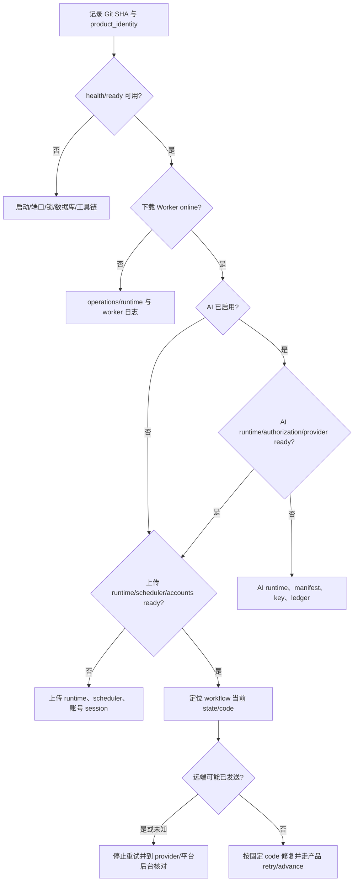

# Open-Flame 完整 Debug 指南

本指南用于定位下载、编辑、AI、自动流程和三平台上传中的问题。先固定被测构建和事实，再改变一个变量。运行状态、业务状态和远端结果分开判断；不要用页面提示、日志或合成测试替代数据库记录与平台后台事实。

## 1. 快速诊断路径



最先采集以下只读信息：

```powershell
$debugBase = 'http://127.0.0.1:8000'
git rev-parse HEAD
git status --porcelain
git show -s --format='author=%an <%ae>%ncommitter=%cn <%ce>%nsubject=%s' HEAD
Invoke-RestMethod "$debugBase/health"
Invoke-RestMethod "$debugBase/health/ready"
Invoke-RestMethod "$debugBase/api/v1/operations/runtime"
Invoke-RestMethod "$debugBase/api/v1/edits/ai/runtime"
Invoke-RestMethod "$debugBase/api/v1/edits/ai/capabilities"
Invoke-RestMethod "$debugBase/api/v1/uploads/status"
(Invoke-RestMethod "$debugBase/api/v1/capability-snapshot?limit=1").current_product_identity
```

记录命令时间、HTTP status、固定 `detail`/`code`、`run_id` 和相关 opaque ID。不要把完整响应直接提交；先删除路径、账号信息和任何可能的秘密。

## 2. 数据与进程地图

普通 Windows 默认 app root：

```text
%LOCALAPPDATA%\Open-Flame\video-download-control\
  data\                 下载 Schema 11、资产、temporary、logs
  data-edits\           Editing Schema 4、编辑副本与成品
  data-workflows\       Workflow Schema 3、无秘密预设
  data-uploads\         Upload Schema 3、受管媒体、账号私有目录、上传 runtime
  data-ai-runtime\      隔离 AI runtime
  runtime-tools\        固定本地工具链（如由 Setup 放置）
```

四个业务域各自拥有状态；下载、编辑和上传域分别拥有自己的媒体，Workflow 只保存跨域 ID、不可变参数快照与状态机。不要把数据库合并，也不要从一个域直接改另一个域的文件。正常 Start 由 supervisor 管理 control、download Worker 和浏览器；EditingManager、Upload scheduler、WorkflowManager 在 control 生命周期内各自持有必要的 worker/owner。

## 3. 先固定复现

1. 记录完整 Git SHA、`product_identity`、app root 标签、版本/Schema、浏览器和时区。
2. 给输入使用唯一测试编号；记录 URL 类型或媒体 SHA-256、大小、时长、codec，不提交未授权内容。
3. 记录最小状态链，例如 `created → downloading → awaiting_ai_review`，以及首次偏离处的 state/code。
4. 只改变一个变量：账号、runtime、源、模型、参数或重启时机。
5. 同一远端动作不要盲目重试。若 AI ledger 或上传任务为 running/unknown，先核对远端。
6. 修复后重跑最小复现，再跑受影响域的回归和整条 workflow；不要只验证错误消息消失。

## 4. 启动、端口与锁

常见症状和检查：

| 症状 | 首查 | 处理 |
| --- | --- | --- |
| Start 立即退出 | 启动 stderr 的固定 JSON、独立 diagnostics JSONL、`data/logs/runtime-local-app.jsonl`（若业务日志已启动） | 使用同一 app root 重跑 Setup 检查；不要复制异常路径到 issue。 |
| 端口占用 | `Get-NetTCPConnection -LocalPort 8000 -ErrorAction SilentlyContinue` | 找到本次用户拥有的进程并正常关闭；不要杀未知服务。 |
| `setup_busy` / worker busy | 是否已有 Start/Setup、app-root/runtime 锁 | 正常退出已有进程，确认已结束后重试；不要删活跃锁。 |
| packaged 开发宿主内 `setup_ai_runtime_failed`，但同一归档在普通临时目录可构建 | 比较 app root 的词法路径与 Python `Path.resolve(strict=True)`；Windows package filesystem virtualization 可能让两者不同 | 停止应用，只在已确认仍属于当前用户本地应用数据时取得 canonical path，并把同一个显式 `--app-root` 同时传给 Setup 与 Start；不要放宽 builder 的 alias/reparse 检查。 |
| `/health/ready` 503 | 返回 detail、队列 paused、数据库结构 | 按具体 code 修复；health 不是平台探测。 |
| 页面能开但 Worker unknown/stale | `/api/v1/operations/runtime` 心跳、同一 `run_id` | 用一体化 Start 重启同一构建；独立 control 不会伪装托管 Worker。 |

默认日志位于 `data\logs`：`runtime-local-app.jsonl`、`runtime-control.jsonl`、`runtime-local-worker-*.jsonl`。同一启动共享 `run_id`。日志是有界、轮转、best-effort 线索；业务事实以 SQLite、attempt/ledger、资产 manifest 和远端后台为准。

仅在上述 packaged 开发宿主条件已被证实时，可用当前项目 Python 取得 canonical path。先人工核对它仍位于当前用户的本地应用数据范围；不要把解析后的私有路径贴入 issue：

```powershell
$canonicalAppRoot = (& .\.venv\Scripts\python.exe -I -c `
  "import os,pathlib; print(pathlib.Path(os.environ['LOCALAPPDATA'],'Open-Flame','video-download-control').resolve(strict=True))").Trim()

.\Setup-Open-Flame.cmd --yes --app-root "$canonicalAppRoot" `
  --ai-python-embed-zip "<ABSOLUTE_VERIFIED_ZIP>"
.\Start-Open-Flame.cmd --app-root "$canonicalAppRoot" --check --no-open-browser
```

上面的 `--check` 只检查核心启动，不领取 Job，也不证明 AI provider、上传 runtime 或 scheduler ready。若上传 runtime 也需要准备，先按[上传运行时升级说明](UPLOAD_RUNTIME.md#从旧运行时升级)保留旧 runtime，并单独给 Setup 加 `--upload-runtime`。完整 Start 会启动下载 Worker、WorkflowManager 和上传 scheduler；启动前必须先核对该应用根是否存在 queued、预授权或可恢复工作，并按本次运行授权决定是否继续。

普通非虚拟化命令行继续使用默认 app root。一次运行中不得混用词法 alias 与 canonical root；否则完整性检查可能把同一目录视为路径漂移并安全拒绝。

## 5. 下载域

关键链路：`Batch → InputRecord → SourceDiscovery/SourceItem → DownloadJob → JobAttempt → MediaAsset`。

- `queued` 且 Worker online：看 platform capability、credential binding、queue pause/cooldown 和 available time。
- `probing/downloading/postprocessing/verifying` 卡住：用 Worker 日志的同一 job/attempt/run 事件判断，检查工具链版本、磁盘和进程是否仍存活。
- `authentication_required`：核对该 Job 冻结的 credential profile 和平台，不把上传账号 Cookie 当下载 Cookie。
- `short_link_resolution_required`：确认入口是否显式允许受控短链展开；不要手工把未知跳转写回数据库。
- `duplicate`：检查递归 owner 是否仍 active、ready、failed 或 canceled。新 workflow 应等待 active owner，并在 owner ready 后复用资产；若直接进入 `download_no_ready_video`，保留 owner/duplicate batch 与 input ID 作为复现证据。
- ready 但无法编辑/上传：核对资产 `media_kind=video`、存在性、大小与 SHA-256；不要替换同名文件。

取消应使用页面/API 的 input-level 或 Workflow 取消入口。取消请求可能先变为 requested；Worker 到安全点后才进入终态。

## 6. 编辑与 AI 域

关键链路：`source → project → draft version → AI task/timeline → render plan → assets`。

### 本地编辑/FFmpeg

- `processor_not_configured`：检查固定 tool root 与 toolchain status，确认 FFmpeg/ffprobe 版本和 offline smoke。
- `source_changed` / `source_hash_mismatch`：源副本与登记快照不同；重新导入或重建，不覆盖旧记录。
- `cover_font_unavailable` / `cover_glyph_unsupported`：选择受支持字体/文字；空文字封面不需要字体。
- `ai_segment_boundary_splits_cue`：分段边界切入字幕 cue；把边界移到 cue 开始或结束。
- `ai_speech_timing_overflow`：配音超过对应时间槽。先记录 plan 的 `recipe_sha256`、dubbing `voice`/`rate`、cue 时长和对应 WAV 时长；再只改变一个变量。可以缩短文本、换标准音色、在 `0.88`～`1.12` 内明确提高语速或人工调整时间轴。新 rate 必须形成新的 recipe/profile SHA 和 request fingerprint；它不会自动重试旧调用，也不会静默截断或顺延。

### AI runtime 与授权

依次检查：

1. `/api/v1/edits/ai/runtime` 的 runtime 完整性。
2. `/api/v1/edits/ai/capabilities` 中 operation/provider/model、manifest SHA、model revision、execution、data egress 与 hard limits。
3. control 进程是否仅收到允许的 `OPEN_FLAME_AI_OPENAI_API_KEY`；不要打印值。
4. workflow/AI task/plan 持久化的 authorization SHA 是否仍匹配当前 capability。
5. `ai_invocations` 中该 owner 的调用状态。

`ai_task_set_invalid` 表示 Workflow 无法从 editing project 的完整 AI 任务集合安全确定当前重试
leaf。它会拒绝缺失起始任务或父任务、重复/无效 ID、同一父任务多个 successor、自引用、循环、
跨项目记录，以及 parent/child 的 operation、source revision 或 request SHA 漂移。同一项目存在
多个彼此独立且各自有效的 transcribe/translate 根任务是合法情况。保留 workflow/project/task
ID 和固定错误码，正常停止应用后用 SQLite backup API 复制数据库与 WAL 到隔离目录再审计；
不要删除旧任务、改 `retry_of`、重算摘要或直接确认猜测出的 leaf。

语速排错时同时核对编辑计划或 workflow 卡片显示的实际值、持久化 recipe 中的 `dubbing.rate`（缺失表示兼容默认 `1.0`）以及 provider request fingerprint。authorization SHA 不随语速改变，因为它绑定 runtime/model/operation/上限；recipe/profile SHA 应在非默认语速变化时改变。若页面恢复预设后改变了区间内合法小数，或输入变化后旧的数据外发勾选仍保留，应按前端回归处理。

远程调用账本语义：

| 状态 | 含义 | 是否可自动重试 |
| --- | --- | --- |
| `reserved` | 已预留，未证明发送 | 否；先由恢复逻辑判定。 |
| `dispatched` | 已跨过远程发送边界 | 否。 |
| `responded` | 收到并验证结构化响应 | 无需重试。 |
| `released` | 发送前释放 | 可按 owner 状态和显式确认重试。 |
| `unknown` | 无法确认远端是否接受 | 否；必须人工 reconciliation。 |
| `reconciled/not_accepted` | 已确认未接受 | 可按 owner 状态和再次确认重试。 |
| `reconciled/accepted_without_result` 或 `abandoned` | 已接受无可用结果或放弃 | 否。 |

不要从 provider health 推断真实模型请求成功，也不要把 request unit 当 token、HTTP 次数或账单金额。

## 7. Workflow 域

先从 `/api/v1/workflows` 获取当前记录，再读取 `/api/v1/workflows/{id}/events`。记录 `revision`、`profile_sha256`、state/code、batch/project/plan/output/source/job refs。

正常阶段：

```text
created → downloading → preparing_edit → awaiting_ai_review
→ awaiting_edit_confirmation → rendering → preparing_upload
→ awaiting_upload_confirmation → uploading → completed
```

### 来源字幕优先复用

只有冻结 profile 含 `ai.transcription_mode=prefer_source_caption` 时，Workflow 才会先寻找下载字幕；字段缺失或值为 `ai` 时直接使用原有 AI transcribe 路径。排查时按以下登记链从右向左核对，不要只看页面是否列出字幕：

```text
workflow.edit_project_id
→ editing project.source_asset_id
→ Download media_assets.id（ready）
→ 唯一 original artifact + ready download job 的 original link
→ caption artifact.parent_artifact_id
→ captions.status=ready / origin=platform
→ artifact path + SHA-256 + MIME + tool name/version
```

候选必须属于同一 `source_asset_id`，且首版只接受 `application/x-subrip`（SRT）或 `text/vtt`。显式源语言优先精确匹配，再按受支持的中文变体或基础语言排序；并列第一名视为歧义。源语言为 `auto` 时，目标为中文会优先英文字幕，目标为英文会优先 `zh-CN`/`zh-Hans`/`zh`，其他目标只有唯一候选时才复用。无候选、不支持格式、语言不匹配或选择歧义属于正常 AI transcribe fallback，不是下载损坏。

成功导入的 transcription timeline 应为 `provider=download`、`state=review`、`code=source_caption_review_required`，model 形如 `source-caption-v1:<artifact UUID>:<完整字幕 SHA-256>`。Workflow 对外显示 `ai_source_caption_review_required`；此时不应已有 transcribe AI task 或远端 ledger 记录。`ready` 与 `origin=platform` 只证明登记来源和文件完整性，不能区分人工字幕与自动字幕，也不能证明文本正确。首次导入即使同时勾选 `auto_confirm_edit` 也必须停下；后台推进以 `authorize=false` 只观察审核结果，不能替操作者批准。生产 Workflow 页面会引导操作者核对 cue 文字、语言和绝对时间后在 Editing 页批准；服务/API 的通用显式确认也只能在首次停下后的后续调用中批准。批准只消费这一步确认，随后 translation 仍走自己的确认和审核。明确拒绝会保留该 immutable timeline，下一次推进改走 AI transcribe。

以下内容问题返回 `source_caption_not_usable` 并安全回退 AI transcribe：字幕为空或超过上限、不是 UTF-8、SRT/VTT 结构无效、选定分段内没有完整 cue、cue 跨越外层或内部任一分段边界，以及明显 HTML/SSA override 标记。实现不会裁切跨界文字或静默剥除标记。确认 fallback 后应只有一个 transcribe root task，并继续执行原有 authorization、data-egress 和调用账本规则；一旦该 task 已建立，后续轮询即固定沿 AI 回退链继续，不能因候选列表随后变化而切换来源并遗留听写任务。

登记或身份漂移必须失败关闭：resolver 返回的 asset/artifact/path/MIME/language/SHA/tool 身份与候选不同通常表现为 `download_caption_unavailable`；payload hash、project 与 source asset 绑定、artifact 身份或同一幂等键定义冲突会保留 `source_caption_conflict` 或更精确的 idempotency/data code。这些情况不得自动 transcribe，因为它们表示读取对象可能已换绑或被修改。先保留 workflow/project/asset/artifact ID，核对只读 API、资产 manifest 和停止应用后复制出的数据库/WAL 副本；不要替换 sidecar、改库或伪造 hash。确认下载资产本身不再可信时，重新下载并建立新 workflow。

重启时，已成功导入的唯一来源 timeline 会先按 project 和完整 provenance 复用，不应仅因原 sidecar 随后不可读而创建第二条 timeline；同一 project 出现多条匹配来源 timeline 应按数据不一致处理。来源 timeline 已批准而 translation 失败时，显式 retry 只能创建 translation successor，并继续绑定同一 parent revision；若出现新的 transcribe task，记录两条 AI task lineage 和 workflow events，按回归处理。

来源封面排障先核对显式 `upload.prefer_download_cover=true`、生成封面 fallback、冻结的 `download_asset_id` 与 `upload_cover_id`：只有可信 owner envelope 下的 0 个 thumbnail 才正常回退；多候选为 `workflow_source_cover_ambiguous`，登记/受管路径/owner 异常为 `workflow_source_cover_unavailable`，实际 hash 漂移由 Download resolver 与 Upload `expected_sha256` 双重拒绝。`preparing_upload` 已有 `upload_cover_id` 但本段尚无 source/job 是合法的两阶段 checkpoint；不要清空它。响应丢失后应从稳定 Upload request 的共同封面槽恢复，封面媒体已合法删除也不应阻止收回 job IDs；尚无本段请求的取消会先写专用空 tombstone，重复取消不得再查询 Editing/Download，也必须继续处理前序分段 jobs。sentinel digest 不匹配应进入 `upload_request_invalid`，不要改库“修复”。完整核对链见[来源封面偏好验证](../validation/iteration-0.28.0-workflow-source-cover-preference.md)。

- `attention_required` 是需要核对的终止点，不等于失败可重试。
- 自动确认只适用于该 workflow 的冻结 intent。重启、retry、legacy migration、running/canceling 和 unknown 有各自保守规则。
- `outputs` 必须按 segment ordinal 排列；每个 output 的 targets 必须与冻结 account/platform 对应。不要只看兼容的单值 `edit_output_id`。
- 来源标题模式的冻结 profile 含 `upload.title_mode=source` 和空公共标题。下载完成后必须同时出现 `download_asset_id` 与只写一次的 `resolved_upload`；后者应含非空公共标题、冻结账号绑定，以及按账号顺序排列的最终标题覆盖。进入后续编辑或上传状态却缺少该快照属于数据不一致。
- `workflow_source_metadata_unavailable` 只表示下载库中的来源标题或本地上传 capability 无法形成安全标题快照。先确认对应 ready asset 关联的 `source_items.title` 非空；X attachment 可检查该 Job 的 `input_record.canonical_url` 所指父 `source_items.title`。再检查 `/api/v1/uploads/status` 中所选平台有合法 `title_limit`。修复后点“立即对账”；它会复用既有 batch/asset，不会再次建立下载或改绑素材。若标题本来就不存在，改用手动标题重新创建流程。
- 若一次冻结后重启，`downloading` 状态中的现有 `resolved_upload` 必须原样复用，不能按新来源元数据或新 capability 重新计算。SQLite trigger 会拒绝修改/清空已冻结值及更换对应 `download_asset_id`；不要手工编辑数据库绕过此边界。旧 Workflow Schema 1/2 profile 不允许 `title_mode`，发现这类预埋字段时迁移应整体失败并保持旧版本。
- 页面记住的预设只在 `/presets`、账号列表和 AI capability 都成功读取后应用。初次读取失败时，预设选择器或帮助文字会显示失败且表单保持原值；刷新成功后，仅在用户未编辑表单时恢复。若帮助文字说明用户已编辑，重新手动选择预设，不要清 localStorage 强迫覆盖。
- 完整视频使用 `segments=[]` 并期待一个输出；分段使用 1–10 个有序、不重叠区间；AI 多段必须首尾连续。
- `workflow_cancellation_requested` 是持久取消意图。manager 重启后应继续取消最远的已创建下游；全部安全停止才成为 `canceled/workflow_canceled`。任何已提交/草稿保存、running 后未知或身份不符都要进入精确的 attention code。
- `workflow_revision_conflict` 表示页面使用了旧 revision；刷新后重新判断，不能自动重放操作。
- 若数据库短暂故障后所有 workflow 停止推进，但各域接口仍可读取，先检查 Workflow 数据库和 control 日志。当前 `WorkflowManager` 会保留扫描游标，并对 `WorkflowError`/`sqlite3.Error` 按最多 6 秒退避后由同一 worker 重试；不要通过反复重启 control 绕过持续数据库错误。未知线程异常仍需先核对最远下游和远端结果，确认没有 running/unknown 后再重启。

若 Workflow 卡住，按最远非空引用进入对应域检查，而不是直接改 Workflow state。修复 runtime/账号后使用页面“立即对账”或重建流程；只有产品明确提供 retry 时才重试。

## 8. 上传域

关键链路：`account → source/cover assets → local draft → queued → running → submitted/draft_saved/failed/unknown`。

- runtime：`/api/v1/uploads/status` 同时看 backend ready、manifest Schema、worker 和 scheduler。`standby` 表示另一实例持有 owner，不应启动第二 scheduler。
- account：只把 `active + ready` 当作本次可选；重登会改变 session revision，旧任务必须停下重建。
- metadata：对照平台 capability 检查标题长度、标签、封面方向、Bilibili 分区/原创转载、抖音声明、视频号 mode/短标题/内容标记和定时窗口。
- confirm：确认前服务再次校验 media/cover SHA、账号 session、schedule 和平台参数。页面预览成功不能替代确认时检查。
- cancellation：draft/queued 可安全取消；running 只发取消请求。若 backend 已调用且结果不能确认，最终必须是 `unknown`。
- `submitted` / `draft_saved`：到平台后台按唯一测试编号核对。部分账号成功、部分取消/失败时不能把整个 workflow 写成 canceled。

`upload_job_failed` 的 Workflow 重试只适用于所有分段都已完成上传准备的完整 fan-out。点击“建立失败投稿重试”后，先到 `/uploads` 核对当前每个 slot；系统只为 failed/canceled leaf 建立新 draft，submitted、draft_saved、queued、running 与原有 draft 不会被复制。新 draft 即使来自预授权 workflow 也必须再次明确确认。

- `upload_retry_confirmation_required`：本批只有 retry draft 等待确认。
- `upload_retry_mixed_confirmation_required`：除了新 retry draft，同批还有原任务 draft；最终确认会把两类 draft 一起排队，必须先逐项核对原因。
- `upload_result_unknown` / `verify_remote_result_first`：停止重试，到平台后台按账号、标题、时间和测试编号核对。Workflow 不允许 acknowledge 后直接重发。
- `upload_request_mismatch`：稳定 request 摘要、root job 或 Workflow 冻结的标题、简介、标签、封面、模式、发布时间、账号绑定及平台参数彼此不一致；即使手工重算 Upload 摘要也不能把漂移后的请求变成合法重试。不要改数据库，保留副本并重建 workflow。
- `upload_request_invalid` / `upload_job_set_invalid` / `job_retry_lineage_invalid`：request 或 retry lineage 不完整、分叉、循环或身份异常；保留 Upload/Workflow 数据库、WAL 与日志，停止确认和重试。
- `account_session_changed`、source/cover 校验失败或发布时间已过：修复账号或素材后重建 workflow；冻结投稿参数不会在 retry 中被静默替换。

如果 Upload 已建立 successor，但 Workflow 仍保存父 job ID，先刷新或点一次“立即对账/建立失败投稿重试”。正常恢复会沿唯一 lineage 写回当前 leaf 并停在确认门，不会再建一代；不要手工改 `upload_job_ids` 或 `retry_of`。完整本地验证见[Workflow 投稿重试记录](../validation/iteration-0.28.0-workflow-upload-retry.md)。

不确定结果处理顺序：停止自动重试 → 记录本地 job/code/time → 到平台后台搜索测试编号 → 记录 `received/not received/unknown` → 仅在确定未收到且产品允许时创建显式 retry。

## 9. Web/UI Debug

1. 先看浏览器 Console 的首个异常和 Network 中首个失败请求；记录 route、method、status 和安全 detail，不保存请求中的敏感正文。
2. 检查页面是否从同一个 loopback origin 打开。下载页先请求 `GET /api/v1/session`，再为所有写操作附加唯一 `X-Download-CSRF`；上传、编辑、自动流程使用各自 session/header，不能交换。`403 download_request_forbidden` 先核对唯一 loopback `Host`、可选同源 `Origin`、`Sec-Fetch-Site` 和当前进程令牌；应用重启、旧页面或直接 API 客户端需重新取得 session。令牌不放 URL/query 且不写入日志或回传材料。会话建立失败时“创建批次”应继续禁用；如果被启用，记录页面和首个失败请求作为前端故障。
3. 轮询问题要复现：保持输入/选区/焦点/details 10 秒以上；判断是 DOM 被重建、迟到响应覆盖，还是记录确实变化。
4. 预设自动恢复问题先检查 `localStorage` 中的 `open-flame-workflow-last-preset-v1` 是否只是 32 位预设 ID。页面必须等账号、AI capability 和预设列表都完成初始读取后才应用；初始化期间已经发生用户输入时不得覆盖表单。不存在的 ID 应自动清除。
5. 视觉问题同时记录 viewport、DPI、theme、系统 reduce-motion/透明度设置和截图。320 px、200% 文字缩放、键盘焦点和深色主题都要复查。
6. CSP 错误要核对生产 HTML 与 `page_content_security_policy()`；不要临时允许 inline/eval 或外网资源来掩盖。

## 10. SQLite 与文件完整性

- 运行中优先用只读 API和正式 backup 命令，不直接复制单个 `.sqlite3` 主文件；WAL 可能含尚未 checkpoint 的提交。
- 需要离线数据库检查时先正常停止整个应用，并确认 worker/scheduler 已退出。随后复制数据库及同名 `-wal`/`-shm` 到新的临时目录，再对副本执行检查；不要在源目录打开调试副本。
- `PRAGMA quick_check` 只是结构检查，不验证业务不变量。各域启动时的 schema/business validator 才是主要门槛。
- 不删除或编辑 `manifest.json`、identity、runtime lock、数据库行或受管媒体来“修复”状态。使用 Setup、备份恢复、重新导入、retry 或重建 workflow。
- 收集文件证据时记录 SHA-256、大小和修改前后 identity；不要把私有媒体复制进仓库。

## 11. 回归与提交

修复后至少执行：

```powershell
uv lock --check --offline
uv pip check
.\.venv\Scripts\python.exe -m compileall -q src
.\.venv\Scripts\python.exe -m pytest -q `
  tests/test_editing_service.py `
  tests/test_editing_ai_contracts.py `
  tests/test_upload_service.py `
  tests/test_upload_resilience.py `
  tests/test_upload_platform_parameters.py `
  tests/test_upload_api.py `
  tests/test_upload_backup_restore.py
git diff --check
git status --short
```

再运行最小复现、受影响页面浏览器检查和 URL→AI→目标平台的本地 synthetic 整链。涉及真实网络时把动作、账号、媒体、费用和平台结果单独授权并记录。

提交前：

1. `git diff --name-status` 确认范围；不得加入 key、Cookie、media、runtime、logs、数据库、build/cache 或 `validation/local/`。
2. 不新增或修改 `tests/`；临时 validator 放 ignored `validation/local/`。正式验收事实写入 `validation/*.md` 或外部测试交接。
3. 更新 `HANDOFF.md`、执行计划、相关指南、验收记录和 `release-files.txt`。
4. 运行 `.\.venv\Scripts\python.exe scripts/verify_commit_scope.py --staged` 与 `git diff --cached --check`。
5. 核对 author/committer 身份、远端 URL、完整提交 SHA 和推送分支。推送并不等于 release 或默认分支合并。

## 12. 最小 Debug 交付包

使用[外部测试回传模板](EXTERNAL_TESTER_HANDOFF_TEMPLATE.md)，至少提供：

- 固定 Git SHA 与运行 `product_identity`；
- 环境、app root 是否全新、各 runtime/status；
- 最小用例、输入特征和重现率；
- 完整 state/code 时间线及相关 opaque IDs；
- 经脱敏的同一 `run_id` 事件；
- 远端是否可能发送及后台核对；
- 截图/媒体/日志在受控位置的引用和 SHA-256；
- 观察事实与推断分开书写；
- 一个明确、有限的下一开发切片及验收条件。

当前工程仍需真实 OpenAI、真人试听、三个平台的逐字段接收/定时/审核/公开验收，以及绑定最终 clean commit 的新 release receipt。任何 Debug 结论都应说明自己证明了哪一层，以及仍未证明哪一层。
