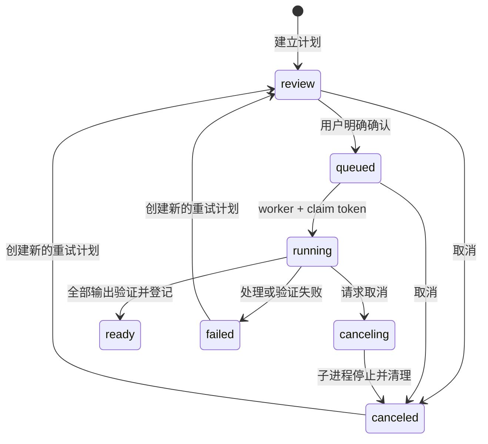

# Open-Flame 0.28.0 编辑工作台指南

日期：2026-09-09
适用范围：Open-Flame 0.28.0 当前源码中的本地编辑与可选 AI 处理

编辑工作台位于 `/edits`，负责在已登记的下载视频与上传器之间生成可核对的派生文件。0.28.0 已实现**视频分段、封面制作、自动听写、自动翻译、字幕和标准音色 AI 配音**；云端操作只有在隔离 AI runtime 完整、`OPEN_FLAME_AI_OPENAI_API_KEY` 存在，并且用户确认与当前 runtime/model/operation/外发范围/硬上限精确绑定的 authorization 后才能执行。当前仓库没有凭据，也没有真实 API 或真人试听证据，因此页面在该环境中仍会把三项云能力显示为 blocked。

本指南不证明任意真实视频均能正确处理，也不证明 OpenAI 或 Bilibili、抖音、视频号已经接收、审核或公开任何成品。当前本地证据见[预授权重启续跑记录](../validation/iteration-0.28.0-workflow-restart-continuation.md)、[三平台参数与封面预检记录](../validation/iteration-0.28.0-workflow-platform-parameters.md)、[多分段自动流程记录](../validation/iteration-0.28.0-multisegment-workflow.md)、[Iteration 0.28.0 AI 与自动流程记录](../validation/iteration-0.28.0-ai-workflow-evidence.md)、[发布后 AI 精确授权与输入硬预算记录](../validation/iteration-0.28.0-post-release-ai-authorization.md)及[Schema 4 远程调用账本记录](../validation/iteration-0.28.0-ai-invocation-ledger.md)；0.27.0 编辑工作台记录保留为历史。

## 1. 完整工作流

```text
ready 下载视频
    │ 进入编辑
    ▼
显式复制到独立编辑根并复核 SHA-256
    ▼
编辑项目 + 版本化草稿
    │ 可选：建立并确认听写/翻译任务
    ▼
审核完整时间轴并批准或拒绝
    │ 可选：把已批准译文和标准音色写入草稿
    ▼
冻结当前草稿和批准的时间轴为 review 计划
    │ 核对本地处理及配音外发范围，再明确确认
    ▼
单个本地 worker 渲染
    ▼
ready 编辑成品（分段 MP4 / 封面 PNG / segment-local VTT / 配音 MP4）
    │ 对视频点击“用于上传”并再次显式导入
    ▼
上传域中的独立媒体副本
    │ 填写平台参数、创建本地投稿草稿、逐任务确认
    ▼
上传适配器才可能被调用
```

下载页输入网址只创建下载任务。需要持久化串接后续步骤时使用 `/workflows`：它按保存的 recipe 和预授权推进，未授权的 AI、编辑或上传节点会停下等待确认。应用重启时，下层域仍撤回旧 queued 确认；只有 canonical profile 已保存对应预授权、当前原始 leaf 可证明尚未 dispatch，且授权/runtime/source/账号 session 重新校验通过时，WorkflowManager 才会重新排队。手动流程、AI/编辑重试、上传 retry leaf、running/canceling 和未知远端结果仍会停下。页面按所选账号显示 Bilibili、抖音与视频号的独立内容、定时、发布模式和平台专属参数，并在提交前限制共同支持的生成封面比例。相同平台多个账号的 preset 差异默认逐账号保留；修改单个字段只统一该字段，另有明确按钮可统一整个平台面板。远程 AI 请求进入 provider 前会写入 Schema 4 调用账本；页面按项目显示脱敏状态，`unknown` 明确标为“远程结果待核对”，并隐藏被账本阻止的重试入口。

### 1.1 从下载成品建立编辑项目

1. 等待下载任务产生 `ready` 且 `media_kind=video` 的原始成品。
2. 在下载页对应成品上点击“进入编辑”。链接只携带下载资产 ID；打开页面本身不会复制视频或启动处理。
3. 在编辑页填写项目名称，点击“复制此下载成品并建立项目”。这是实际导入边界。
4. 服务重新解析下载资产，确认它仍为 ready 视频，复制文件到编辑域，并在复制过程中重新计算大小与 SHA-256。
5. 下载域登记摘要、源文件摘要或文件身份不一致时，导入失败关闭。渲染前处理器还会按计划来源的登记大小和 SHA-256 重新读取完整编辑源，再以同一文件身份约束后续 probe/FFmpeg；下载原件不会被移动、覆盖或重编码。输入 demuxer 由受管后缀固定：MP4/MOV/M4V 使用 `mov`，MKV/WebM 使用 `matroska`；ffprobe 与 FFmpeg 只允许 `file` protocol，并复核对应的精确 format name。伪装成视频的 ffconcat/playlist 不能借已登记源摘要读取同目录其他媒体。

编辑导入目前接受 `.mp4`、`.mkv`、`.mov`、`.webm` 和 `.m4v`，单个源文件上限为 16 GiB。目标磁盘必须至少保留“待复制文件大小 + 64 MiB”的可用空间。符号链接、reparse point、非普通文件及多 hard-link 文件会被拒绝。

### 1.2 保存版本化草稿

新项目自动建立空的草稿 `v1`。编辑页目前要求至少添加一个分段；每次点击“保存编辑草稿”都会追加一个新版本，不会覆盖旧版本。

保存请求携带 `expected_version`。如果另一页面已经先保存了新版本，旧页面会收到 `draft_version_conflict`，必须刷新并根据新版本重新编辑。每个草稿保存完整 canonical recipe 及其 SHA-256。

旧草稿和已经建立的处理计划保持不变。用户可以继续保存 `v3`、`v4`，而基于 `v2` 的旧计划仍精确引用 `v2`。

### 1.3 生成待核对计划

“生成待核对处理计划”会先保存当前表单，再把该草稿版本、完整 recipe 和 recipe SHA-256 冻结为新的 render plan。新计划状态为 `review`，代码为 `explicit_confirmation_required`。

建立计划不会运行 FFmpeg。用户应核对计划引用的草稿版本、分段和封面参数，然后单独点击“确认并开始本地处理”。只有这次明确确认才把计划转为 `queued`。

### 1.4 本地渲染与编辑成品

应用内只有一个本地编辑 worker。第一次打开编辑服务时，它先在编辑根旁取得跨进程独占 activity lease，并在 worker 与已进入服务层的 API 操作全部结束前持续持有；同一编辑根的第二实例会以 `editing_worker_busy` 失败，不会先恢复或改写第一个实例的计划。它按确认顺序领取一项 `queued` 计划，并为该次执行生成随机 claim token。输出先写入该计划和 claim 私有的 staging 目录，验证完成后才复制到正式 `assets/` 并登记为 `ready`。

页面中的“下载成品”读取正式受管输出。每次读取都会在同一个打开的文件句柄上复核大小和 SHA-256，同时建立 1 MiB 分块摘要；响应每个分块前会再次核对其摘要，等长原地改写也不能把新字节混入完整响应。实现不会校验后重新按路径打开，也不会为大文件建立完整 TEMP 副本；文件缺失或被修改时不会继续提供。源视频预览使用相同边界。

### 1.5 显式导入上传

只有 `ready` 的 `segment` 或未来的 `dubbed_video` 可成为上传视频来源。封面、字幕和独立音频不能通过视频入口导入。

1. 在视频编辑成品上点击“用于上传”。
2. 上传页显示待导入提示，但不会因 URL 参数自动复制文件。
3. 用户点击导入按钮后，上传服务从编辑域解析 ready 成品，复制到独立上传媒体根并重新计算 SHA-256。
4. 导入完成只新增一个上传来源，**不会创建投稿任务**。
5. 用户仍须选择账号、填写各平台标题、标签、封面、发布时间等参数，创建本地草稿，再逐任务明确确认。

因此存在三次相互独立的动作：确认编辑渲染、导入上传来源、确认投稿任务。前一次动作不授权后一次动作。

## 2. 当前分段能力

一份 recipe 最多包含 100 个分段。时间在 UI 中用秒输入，在 API 和数据库中保存为整数毫秒。

- 每段必须满足 `0 <= start_ms < end_ms <= 604800000`。
- 每段至少 100 ms。
- 分段必须按时间排序且不能相互重叠；相邻分段可以首尾相接。
- 起止时间必须落在真实源视频时长内。
- UI 可读取播放器当前时间作为起点、终点或封面抽帧位置。
- 片段名称只作为 recipe 中的显示信息，不进入命令参数或文件路径。

每段都重新编码为固定安全文件名 `segment-001.mp4`、`segment-002.mp4` 等。当前处理参数为 H.264（`libopenh264`、4 Mbit/s、`yuv420p`）和可选 AAC（192 kbit/s）；源视频没有音轨时，输出也不伪造音轨。字幕流、data stream 和源 metadata 不写入分段，输出使用 `+faststart`。

单次计划的全部正式输出上限为 8 GiB。开始 FFmpeg 前会按固定视频/音频码率、逐段余量和可选封面估算计划空间，并为 staging 到正式 assets 的复制按两份峰值预算，再额外保留 64 MiB。每个 FFmpeg 输出还带固定 `-fs` 上限；运行期间约每 250 ms 检查受管目标大小、累计输出和剩余空间，越界时终止进程树并清理部分文件。空间不足返回 `editing_storage_full`，输出预算越界返回 `media_output_too_large`。

完成前会用 ffprobe 复核 MP4 container、H.264、音频 codec、尺寸和实际时长。实际时长与计划时长误差超过 500 ms 时整项失败，已有部分输出不会发布。

启用已批准的翻译或配音时，时间轴按每个分段单独处理：只保留完整落入该段的 cue，把时间减去分段起点，再分别生成 `caption-001.vtt`、`dubbed-video-001.mp4` 等成品；只有一个输出窗口时字幕名为 `caption.vtt`。分段边界若切入任一 cue，会以 `ai_segment_boundary_splits_cue` 拒绝整项，不能把一句字幕或配音无提示地截断。某段没有 cue 时仍可作为纯 B-roll 输出空 WebVTT 和本地确定性静音，不调用 TTS。

每段配音轨从本段 0 ms 开始独立构造，临时 cue WAV 与轨道在该段渲染后删除。选择“压低原声后叠加”时，原声固定为 22%，配音保持原电平，`amix` 不做自动归一化并在输出前限幅；选择替换时只使用配音轨。这个固定混音只描述实现参数，最终响度和可懂度仍须真人试听。

## 3. 当前封面能力

封面从源视频指定时间抽取一帧，再在内存中完整解码、居中裁切、缩放并输出静态 PNG。页面当前提供以下比例：

| 比例 | 输出尺寸 |
| --- | --- |
| 16:9 | 1280 × 720 |
| 4:3 | 1200 × 900 |
| 3:4 | 900 × 1200 |
| 9:16 | 720 × 1280 |
| 1:1 | 1080 × 1080 |

底层 recipe 还支持 `source`：保持源比例，最长边不超过 1920 × 1080，且不放大；0.28.0 页面没有暴露该选项。底层也定义了副标题字段，但当前页面只提供标题，副标题保存为空。

标题会自动换行并放在底部黑色圆角底板上。页面限制标题 80 个字符，API 上限为 120 个字符。纯可打印 ASCII 使用 Pillow 随 12.3.0 wheel 提供的内嵌默认字体；标题或副标题含非 ASCII 字符时，只读取固定 OS allowlist 中的系统字体。Windows 依次检查 `C:\Windows\Fonts` 下的 Microsoft YaHei、Noto Sans SC、DengXian 与 SimHei 固定文件名；Linux 只检查 `/usr/share/fonts` 下固定的 Noto Sans CJK 路径。不会调用 fontconfig、接受用户字体路径、联网或从 CDN 下载字体，也不会把系统字体复制进编辑数据或发行包。

候选字体单文件最多 32 MiB。处理器从经过普通文件与稳定 identity 检查的同一打开句柄读取一次 bytes，之后各字号都从该内存快照建立字体，不按路径二次打开。每个非空白字符都会与该字体的 `.notdef` glyph 比较；无允许字体返回 `cover_font_unavailable`，字体存在但缺少任一字符返回 `cover_glyph_unsupported`。字体预检发生在 ffprobe、分段或封面 FFmpeg 命令之前，因此失败不会留下或发布同一计划的部分成品。无文字封面不需要字体，仍可正常抽帧。

本轮 Windows 本机已验证固定候选中存在可区分“中”“文”的中文 glyph；这只是该主机证据。当前 digest-pinned `python:3.12.13-slim-bookworm` candidate Dockerfile 没有安装、固定或验收任何字体，未知 tool image 中偶然存在的字体也不属于合同，因此当前 Linux/Docker 候选对非 ASCII 封面文字必须按 `cover_font_unavailable` 失败关闭。若后续要在容器内支持中文，应另行固定字体制品、来源、摘要、许可证与镜像验收，不能把 Windows 系统字体打包进去。不同 OS 字体版本也可能改变排版与 PNG 摘要，须按目标环境分别验收。

抽帧 PNG 与最终 PNG 均受 64 MiB 文件、4000 万像素和 64 MiB 解码预算限制；带方向旋转标记、动画或无法完整解码的图片会失败关闭。

## 4. 计划状态、失败、取消与重启



取消和失败遵循以下边界：

- `review` 或 `queued` 取消后直接成为 `canceled`，不会生成 ready 输出。
- `running` 取消后先成为 `canceling`。取消事件会传给受控子进程；子进程停止后清理这次执行的 staging，并成为 `canceled`。
- 取消是协作式进程终止。收到取消响应不等于在同一瞬间已经删除所有临时字节，应等待计划进入终态。
- 已经 `ready` 的成品不会因再次调用取消而被撤销或删除。
- 一项 recipe 中任一分段、封面、ffprobe 或发布校验失败时，不发布该次执行的部分成品。
- `failed` 或 `canceled` 只能创建一个新的 `review` 重试计划；重试复制原计划的不可变 recipe，仍须再次明确确认。
- AI task 重试和包含远程 TTS 的 render plan 重试都先建立唯一后继并停在待确认状态。后继沿用旧任务/recipe 的 authorization，但只有该 authorization 仍与当前 runtime 精确一致时才可再次确认；缺少绑定的旧记录必须重建。Schema 4 账本的 `reserved`、`dispatched`、`unknown` 阻止 owner 完成和重试；`reconciled/accepted_without_result` 与 `reconciled/abandoned` 仍阻止重试。`responded`、`released` 或 `reconciled/not_accepted` 只恢复原有重试资格评估，仍须满足 failed/canceled、唯一后继及再次确认。账本不保存远程 request ID 或复用部分结果，已经完成的翻译批次或配音 cue 仍可能产生费用。
- 应用在取得编辑根独占 lease 后执行重启恢复：`running` 和 `canceling` 会变为 `failed`，错误码为 `render_interrupted`；`queued` 会退回 `review`，清除旧确认并标记 `restart_confirmation_required`。恢复会删除 `sources/` 与 `assets/` 中“严格小写受管 ID + 精确小写允许后缀”但数据库未登记的崩溃残留，也会清理严格 `<plan_id>/<claim_token>` 且不属于活动 claim 的 staging，包括计划已进入终态但上次尚未完成删除的目录。case-only 文件名、未知名称、非普通文件、link/reparse 与其他不安全条目保持原样。该域不会直接重放；上层 `/workflows` 仅能用原始、不可变的预授权重新确认没有 `retry_of` 的 restart 记录，手动编辑和所有 retry 仍须重新确认。
- 停止应用后不再接受新服务操作。如果 worker 或已经进入服务层的 API 操作未能在等待时间内结束，独占 lease 会继续保留；最后一个活动方退出后才通过同一幂等路径交还，避免另一实例在文件已复制但尚未登记时执行恢复。
- claim token 不匹配的旧 worker 不能登记结果；这类结果以 `stale_render_claim` 拒绝。

常见失败含义：

| 错误码 | 含义 |
| --- | --- |
| `processor_not_configured` | 固定 FFmpeg/ffprobe 未达到 ready 且通过 offline smoke 的条件，计划保持待核对 |
| `source_hash_mismatch` / `source_changed` | 下载摘要不一致，或编辑副本在校验期间/之后发生变化 |
| `invalid_edit_recipe` | 时间、区间、封面或其他 recipe 参数无效，或超出源时长 |
| `capability_unavailable` / `ai_operation_blocked` | 请求了尚未接线或明确阻塞的 AI 能力 |
| `ai_authorization_binding_required` | 旧 task、recipe 或 workflow 没有精确 authorization；可读取历史，但须按当前能力重建后才能执行 |
| `ai_authorization_changed` / `ai_task_definition_changed` | 页面看到的摘要、持久化 request/recipe/profile 或当前 runtime/model/limits 已变化；刷新后重新建立或核对 |
| `ai_authorization_invalid` / `ai_budget_invalid` | authorization 或预算计数不符合严格 schema，失败关闭 |
| `ai_budget_exceeded` | 完整输入或预估调用数超过此次 authorization 的固定硬上限；provider 请求不会开始 |
| `editing_storage_full` | 复制前检测到可用空间不足 |
| `editing_storage_unavailable` | 编辑目录或空间信息当前无法安全读取 |
| `media_output_too_large` | 预计或实际计划输出超过 8 GiB，或单项超过其固定 FFmpeg 上限 |
| `cover_font_unavailable` | 非 ASCII 封面文字没有可用的固定 OS 系统字体；不回退为方框或联网取字体 |
| `cover_glyph_unsupported` | 固定候选字体缺少标题或副标题中的至少一个字符；不删除或替换缺字 |
| `media_processing_failed` | FFmpeg、ffprobe、codec、时长、图片解码或输出校验失败 |
| `ai_segment_boundary_splits_cue` | 分段边界落在字幕 cue 内；调整分段或时间轴后重新建立计划 |
| `ai_data_egress_confirmation_required` | 配音计划缺少与冻结 recipe 对应的显式外发/费用确认 |
| `ai_speech_timing_overflow` | 某个配音 cue 超过其字幕时间槽；不会截断或推迟后续 cue |
| `asset_changed` | 已登记编辑成品的大小或 SHA-256 已变化 |
| `render_interrupted` | 本地 running/canceling 计划在上次进程退出时未完成 |

错误响应只返回稳定代码，不返回本机路径或子进程 stderr。真实素材失败时先保留计划 ID、草稿版本和错误码；不要把一次 synthetic 通过解释为任意 container、codec 或损坏媒体都兼容。

## 5. Data root 与 Editing Schema 4

若下载数据根为 `data`，编辑数据根默认为它的同级目录 `data-edits`。一般规则是给下载数据根的目录名追加 `-edits`；例如 `D:\OpenFlame\private-data` 对应 `D:\OpenFlame\private-data-edits`。

```text
data-edits/
├── editing.sqlite3
├── sources/                 # 导入后的不可变编辑源副本
├── assets/                  # 完成并验证的正式编辑成品
└── staging/
    └── <plan_id>/<claim_token>/
```

编辑根与下载数据库/媒体、下载 Cookie、上传 Schema 3、上传媒体及上传账号凭据相互隔离。上传导入会再次复制文件，不通过共享路径绕过两个域的校验。

Editing Schema 4 使用 SQLite `application_id=0x4F464544` 和 `user_version=4`。Schema 1/2/3 只有在结构与语义精确匹配时才按顺序向前迁移；Schema 3 为每个 AI render plan 增加不可变的已批准时间轴绑定及父时间轴摘要，Schema 4 再增加不可变的远程 AI invocation 定义和受 trigger 约束的单向状态转换。启动时要求表、索引和 trigger 与精确 DDL 一致，并执行 `quick_check` 与 foreign-key 检查；未知表、缺失索引、损坏、更高版本、替换竞态或不安全数据库文件都会拒绝打开。

Schema 3→4 迁移只为“可能已经 dispatch 到远程 provider”的旧 AI task/render plan 建立 `legacy=1`、`attempt=0`、`state=unknown` 哨兵。能证明 authorization 为 `local` 的旧 owner 不建立远程记录；缺少或无法解析 authorization 时不能反推为本地执行，因此仍保守建立 unknown 哨兵，授权摘要可显示为“旧记录未绑定”。这些旧记录保持可解释，但必须人工 reconciliation，不能由迁移自动判定供应商是否接受或计费。

| 表 | 用途 |
| --- | --- |
| `metadata` | 唯一 Schema 版本行 |
| `sources` | 编辑源 ID、下载资产 ID、名称、后缀、大小、SHA-256 与创建时间 |
| `projects` | 项目与源的关系、当前草稿版本 |
| `drafts` | 按 `(project_id, version)` 保存不可变 recipe 与摘要 |
| `render_plans` | 冻结的草稿版本、recipe、状态、claim、确认/开始/完成时间及重试来源 |
| `timeline_revisions` | 不可变听写/翻译 cue、摘要、父修订及一次性审核状态 |
| `ai_tasks` | 不可变 provider/model 请求、状态、claim、后继重试和结果修订 |
| `ai_invocations` | 不含正文/密钥/路径/响应的远程调用 owner、operation、ordinal/attempt、调用单位、摘要、状态、固定核对结论和时间 |
| `plan_timeline_bindings` | 计划绑定的已批准译文、父字幕与两份摘要 |
| `assets` | ready 输出的种类、名称、大小、SHA-256、时长、尺寸、container 与 codec |
| `requests` | 幂等请求键、操作、请求摘要与结果 ID |

`drafts` 禁止 UPDATE/DELETE，render plan 的项目、草稿版本、recipe、摘要、创建时间、时间轴绑定和重试来源禁止修改。当前 0.28.0 没有编辑数据库备份 CLI 或编辑成品删除/配额 UI；不要把下载/上传备份能力推定到编辑根。

## 6. 编辑 API

所有编辑 API 以 `/api/v1/edits` 开头。写请求必须来自同源页面并携带 `/session` 返回的 `X-Editing-CSRF`；middleware 同时核对 Host、Origin 和 `Sec-Fetch-Site`。响应设置 `Cache-Control: no-store`、`X-Content-Type-Options: nosniff`、`Referrer-Policy: no-referrer` 与 `X-Frame-Options: DENY`。

| 方法与路径 | 当前行为 |
| --- | --- |
| `GET /session` | 取得本次进程内 CSRF token |
| `GET /capabilities` | 返回分段、封面、听写、翻译和配音的诚实能力状态；不安装或探测 AI 模型 |
| `GET /ai/runtime` / `GET /ai/capabilities` | 分别返回 runtime 完整性与 manifest 中可核对的 provider/model/外发范围；不会替代真实执行健康 |
| `GET /status` | 返回 Schema 版本、processor 是否配置、项目数、计划/AI task/时间轴及 invocation 状态计数 |
| `GET /projects` | 列出编辑项目及当前草稿摘要 |
| `GET /projects/{project_id}` | 读取单个项目 |
| `POST /projects/assets/{download_asset_id}` | 显式复制 ready 下载视频并建立项目；body 含 `name`、`idempotency_key` |
| `GET /projects/{project_id}/draft` | 读取当前草稿 |
| `PUT /projects/{project_id}/draft` | 以 `expected_version` 追加草稿版本 |
| `POST /projects/{project_id}/plans` | 从指定当前版本建立 `review` 计划 |
| `GET /projects/{project_id}/source` | 同源预览经过复核的编辑源副本 |
| `GET /plans?project_id=...` | 列出全部或某项目的计划 |
| `GET /plans/{plan_id}` | 读取计划、冻结 recipe 和已登记输出 |
| `POST /projects/{project_id}/ai-tasks` | 建立待确认听写/翻译任务；创建本身不调用 provider |
| `GET /ai-tasks` / `GET /ai-tasks/{task_id}` | 列出或读取 AI task、状态、重试来源和结果修订 |
| `POST /ai-tasks/{task_id}/confirm` | 提交匹配的 request/authorization SHA-256 与外发确认；服务复核当前 runtime 后才排队 |
| `POST /ai-tasks/{task_id}/cancel` / `retry` | 取消活动任务，或为 failed/canceled 建立唯一待确认后继 |
| `GET /ai-invocations?project_id=...` | 返回项目范围的脱敏调用行，以及 `counts`、`total`、`request_units`、`unresolved` 汇总 |
| `POST /ai-invocations/{invocation_id}/reconcile` | 对一项 `unknown` 提交 `expected_revision`、三项固定 `resolution` 之一和 `acknowledge=true`；没有自由文本 |
| `GET /timelines` / `GET /timelines/{revision_id}` | 读取完整听写/译文时间轴 |
| `POST /timelines/{revision_id}/review` | 以 `expected_review_version` 一次性批准或拒绝整份修订 |
| `POST /plans/{plan_id}/confirm` | 明确确认并排队；配音计划还须提交匹配的 recipe/authorization SHA-256 和外发确认；processor 未配置或绑定漂移时不排队 |
| `POST /plans/{plan_id}/cancel` | 取消 review/queued，或请求取消 running |
| `POST /plans/{plan_id}/retry` | 从 failed/canceled 建立新 review 计划；body 含 `idempotency_key` |
| `GET /assets?project_id=...` | 列出全部或某项目的正式成品 |
| `GET /assets/{asset_id}` | 读取成品 metadata |
| `GET /assets/{asset_id}/content` | 复核并读取成品；视频作为 attachment，封面 inline |

编辑域 ID 为 32 位小写十六进制；下载资产 ID 使用 canonical UUID。创建项目、保存草稿、创建计划和重试使用幂等键：只有相同键、相同操作和相同请求摘要才能安全重放；相同键对应不同内容时返回 `idempotency_conflict`。

编辑 JSON 不返回本机路径。内部 `resolve_output()` 只解析经过复核的 ready `segment`/`dubbed_video`，随后上传 API 的 `POST /api/v1/uploads/sources/edits/{output_id}` 才执行第二次复制。调用这个上传导入 API仍不会创建 upload job。

## 7. AI 时间轴、隔离 runtime 与 provider 合同

- `TimelineCue` 保存稳定 cue ID、顺序、整数毫秒起止时间、来源文字、来源语言与可选 speaker ID。SRT/WebVTT parser 只接受 UTF-8，单文件上限 2 MiB，最多 10000 个 cue；所有进入当前时间轴、翻译和 TTS 的单 cue 文字统一限制为 4096 字符。
- 听写与翻译分别保存不可变 AI task；创建停在 `review`，明确确认后才进入队列。provider 返回的时间轴或译文先保存为 `review` revision，只有整份批准后才可作为下一步输入。
- `TranslationRevision` 必须按原 cue ID、数量和顺序返回译文，不能丢段、换序或偷偷合并。时间轴 JSON 上限为 3 MiB，为隔离 runtime 的 4 MiB 请求 envelope 留出操作字段和 glossary 空间。
- 当前 AI runtime 与核心 `.venv`、上传 runtime 分开；builder 冻结 CPython、worker、协议、provider、model declaration 和全文件摘要。标准库 OpenAI provider 不依赖 SDK，API key 只从 `OPEN_FLAME_AI_OPENAI_API_KEY` 读取。
- 自动流程的听写请求允许完整视频、一个分段或首尾连续的多个分段；有分段时以首段起点和末段终点作为 `clip_start_ms` / `clip_end_ms`，本机 FFmpeg 只派生该连续范围的 mono AAC，provider 返回的相对时间随后加回首段起点。含间隙的多分段在创建远端任务前以 `workflow_ai_segments_must_be_contiguous` 拒绝，避免发送未选择的音频。编辑页直接建立听写任务时当前没有片段选择控件，默认处理完整编辑源。
- `SpeechOptions` 允许有限的 0.88～1.12 倍语速；编辑页和自动流程页会把实际数值冻结到 dubbing recipe，预设原样恢复。默认 `1.0` 为兼容旧记录而不写入 canonical JSON；非默认值改变 recipe/profile SHA-256，并进入逐 cue provider request 与调用指纹。每个 cue 独立取得 WAV、检查格式和时长，再在对应分段内构造 PCM 轨。超出时间槽以 `ai_speech_timing_overflow` 失败，不自动再次调用、截断或顺延后续 cue。
- 页面把 provider、model、本地声明 revision、runtime manifest 摘要、标准音色、精确数据外发范围和 effective limits 显示在确认边界。canonical authorization 还绑定 runtime ID/version、protocol schema、provider kind 与 operation；AI task request、配音 recipe 和 Workflow profile 持久化完整值及摘要。创建、确认、worker 和 provider 调用前均与当前能力做摘要/定义 CAS，缺少绑定的旧记录保持可读但必须重建。只有至少一项 authorization 为 `remote` 时才要求数据外发确认；全部为本地 plugin 时由编辑/AI 执行确认覆盖，不伪装成外发。
- 核心硬上限为：听写 30 分钟且 25 MiB/1 请求；翻译 1000 cues、60000 输入字符、20 个按 50 cues 估算的调用单位；TTS 600 cues、60000 输入字符和 600 次调用。完整输入在第一次 provider 请求前核对，超限以 `ai_budget_exceeded` 失败关闭。这些上限限制一次操作的输入与调用数，不是价格、账号额度或实际 usage ledger。
- Schema 4 为远程 `transcribe`、`translate`、`synthesize` 保存脱敏调用 envelope。状态只沿 `reserved→dispatched→responded`、`reserved→released` 或 `dispatched→unknown→reconciled` 前进；发送前失败可释放，发送后无法确认结果必须保留 unknown。账本不保存正文、密钥、本机路径、endpoint、HTTP header、provider request ID 或响应。
- `unknown` 只能通过带 revision CAS、`acknowledge=true` 的固定结论 `not_accepted`、`accepted_without_result`、`abandoned` 人工核对。前者允许在原有显式确认流程下重新评估重试；后两者继续阻止重试。`reserved/dispatched/unknown` 同时阻止 owner 完成与重试，不能通过直接改 UI 或 SQLite 绕过。
- 翻译的账本 `request_units=ceil(cues/50)` 是 runtime envelope 和授权硬预算估算。provider 会为了满足 4 MiB request envelope 动态缩小 batch，因此它不是精确 HTTP 请求数、token usage、费用或账单收据。听写记 1 单位，配音每个有文字 cue 的 ordinal 记 1 单位；`health` 检查不入账，也不证明真实 OpenAI 可用。
- AI task 和配音计划重试都建立唯一后继并再次确认；当前没有远程 request ID、部分批次复用、准确费用预估、持久化 token/金额 usage ledger 或远端删除记录。manifest 中的 model revision 只是本地声明，远端 alias 仍可能在同一名称下漂移。
- 没有声音克隆；首批只允许 manifest 中 13 个标准音色。不能直接修改 API/SQLite 状态把 AI 能力或 timeline 伪装成 ready。

## 8. 后续 AI 验收与本地 provider 方向

0.28.0 发布后源码已完成逐操作 authorization、输入/调用硬上限、Editing Schema 4 远程调用账本、非密钥复用预设、完整 URL→AI→编辑→三平台上传草稿的本地 synthetic smoke、三平台参数卡与下载前封面预检，以及已预授权、确定尚未 dispatch 的原始 queued AI/render/upload 安全重启续跑；`running`、retry 与 unknown 继续停下。下一工程切片等待用户选定液态玻璃方向后统一四页生产视觉。之后再在同一冻结构建上使用有权处理的短样本，分别记录听写、中文/English 翻译、13 个标准音色中的实际选择、取消/重试、segment-local 输出、供应商 request/账单证据、实际费用和真人试听；真实结果不能由 manifest、账本人工结论或 synthetic 媒体推定。

本地 provider 仍是后续方向。若继续实现本地 ASR/翻译/TTS，应分别固定模型 revision、文件 SHA-256、许可证、架构和转换参数，并复用现有 task/timeline/plan 确认边界。候选研究包括 faster-whisper/CTranslate2、M2M100 与 Kokoro；这些候选尚未进入 0.28.0 runtime，也没有 ready 声明。

## 9. 可选 OpenAI provider 的当前官方边界

0.28.0 已接入一个可选、隔离的 OpenAI provider；安装与凭据步骤见 [AI Runtime](AI_RUNTIME.md)。它不随主包携带模型权重或密钥，启用前必须显示媒体、文字或音频会离开本机，并取得相应确认。

### 9.1 自动听写

- 文件听写使用 `POST /v1/audio/transcriptions`。OpenAI 当前[文件听写指南](https://developers.openai.com/api/docs/guides/speech-to-text)建议普通录音先用 `gpt-transcribe`；单文件最大 25 MB，接受 `mp3`、`mp4`、`mpeg`、`mpga`、`m4a`、`wav` 和 `webm`。
- 编辑时间轴需要词级时间戳时，官方当前只为 `whisper-1` 支持 `response_format=verbose_json` 与 `timestamp_granularities[]=word`。因此不能把 `gpt-transcribe` 的纯文本结果冒充精确 cue 时间轴。
- 需要说话人标签时可评估 `gpt-4o-transcribe-diarize` 和 `diarized_json`；返回 segment 的 `speaker`、`start` 与 `end`。超过 30 秒的音频需要 `chunking_strategy=auto` 或 VAD 配置。它提供的是 speaker segment，并不等同于 `whisper-1` 的词级时间戳。
- `POST /v1/audio/translations` 当前由 `whisper-1` 把语音翻译为 **English only**，不能作为中文及任意目标语言的通用翻译 API。

### 9.2 分段文字翻译

任意目标语言翻译应通过 Responses API 的文本模型完成，而不是使用 English-only 的 audio translations endpoint。请求应采用[Structured Outputs](https://developers.openai.com/api/docs/guides/structured-outputs)，要求模型严格返回 `{segment_id, target_text}` 数组，并在本地再次验证 cue ID、数量和顺序。

模型应由 provider 配置保存并经过固定测试；不要把会自动更新的别名当作可重复构建证据。候选模型及当前可用性以[官方模型目录](https://developers.openai.com/api/docs/models)为准。翻译还需覆盖拒绝、不完整输出、token 上限、速率限制和部分请求失败，所有输出先保存为待审阅 revision。

### 9.3 AI 配音

- `POST /v1/audio/speech` 的当前首选模型是 [`gpt-4o-mini-tts`](https://developers.openai.com/api/docs/guides/text-to-speech)。它支持 `instructions` 控制口音、语速、语调和情绪等表达。
- [Create speech API reference](https://developers.openai.com/api/reference/cli/resources/audio/subresources/speech/methods/create)给出的单次输入上限为 4096 字符，输出可选 MP3、Opus、AAC、FLAC、WAV 或 PCM。工作台应逐 cue 请求 WAV/PCM，再自行测量并对齐时间槽。
- 官方列出 13 个内置音色，并说明音色目前主要针对 English 优化；中文必须经过单独真人试听，不能仅凭语言列表标为 ready。
- Audio Speech 返回音频内容或音频流，当前官方指南没有给出可依赖的词级时间戳输出。时间轴对齐仍由 Open-Flame 的分段、ffprobe 时长测量和 overflow 复核负责。
- OpenAI 使用政策要求向最终用户清楚披露听到的是 AI 生成声音。
- Custom Voice 仅向符合条件的客户开放，并要求 consent recording 与匹配的 sample recording。Open-Flame 首批继续禁用声音克隆。

### 9.4 密钥与隐私

- API key 只能进入后端隔离 runtime，通过环境变量或操作系统 secret manager 提供；不得写入浏览器、URL、编辑 recipe、SQLite、普通日志、备份或发行包。OpenAI 的[生产最佳实践](https://developers.openai.com/api/docs/guides/production-best-practices#api-keys)同样要求不要把 key 硬编码到代码或公开仓库。
- provider capability 应列出精确 data egress：听写上传音频；文本翻译上传 source cue 与上下文；TTS 上传译文、voice 和 instructions。可以用“本地 ASR + 云翻译/TTS”减少完整视频外发，但它仍会外发文字。
- 根据 OpenAI 当前[API 数据控制说明](https://platform.openai.com/docs/models/default-usage-policies-by-endpoint)，API 数据默认不用于训练，除非客户明确选择共享；不同 endpoint 的 abuse monitoring 与 application-state 保留不同，符合条件的客户可申请 Modified Abuse Monitoring 或 Zero Data Retention。实现时必须显示当时组织/项目的实际配置，不能仅凭 endpoint 名称宣称零保留。
- 文档当前列出 `/v1/audio/transcriptions` 与 `/v1/audio/translations` 无默认 abuse-monitoring/application-state 保留，`/v1/audio/speech` 有最长 30 天 abuse-monitoring 日志且无 application state；Responses API 的默认 application-state 行为另有 30 天边界。供应商政策可变化，启用和每次发行冻结时均需重新核对。
- 云请求尚未被服务端接受时可安全取消；一旦接受，稳健实现应保存 provider request/job ID 并结合供应商事实 reconciliation，再决定重试。当前 Schema 4 只保存本地调用 fingerprint、状态和三项人工结论，尚未保存可向供应商查询的 request/job ID；因此 UI 把 `unknown` 明确标为“远程结果待核对”，隐藏账本阻止的重试入口，并警告人工结论不能证明未计费。允许重试的任务或计划仍必须再次确认。

本地 provider 应保持默认选项。任何云 provider 都必须在凭据存在、数据范围可见、费用边界可核对、用户明确确认且当前隐私说明复核后才进入 `queued`。

## 10. 当前可以准确声称的结果

0.28.0 当前发布后源码建立了下载成品到独立编辑副本、版本化草稿、可审核 AI 时间轴、绑定修订的处理计划、本地分段/封面/字幕/标准音色与可选语速配音渲染、编辑成品、显式导入上传和持久化 URL 自动流程，并把新 AI 操作绑定到精确 runtime/model/operation/外发范围、固定输入/调用上限及 Schema 4 脱敏远程调用账本。Workflow Schema 2 进一步保存最多 10 个有序输出及其 segment/source/account/platform/job 关系，最多 30 个草稿在一次批量确认中进入上传；逐段准备失败可从已保存 prefix 幂等恢复，原始预授权 queued 工作可在重启后重新校验并续跑。自动流程页可恢复配音语速，并可填写首批三平台的独立内容、定时、发布模式和专属选项。仓库内验证只覆盖本机定义、ignored validator、synthetic/fake 编排、本地媒体处理、compileall 和既有回归；测试文件按仓库策略未修改。以上结果不构成价格预算、精确 HTTP/usage/账单收据、远端 alias 冻结、真实 OpenAI 账号调用、真人试听、三平台真实投稿或新发行制品证据。
